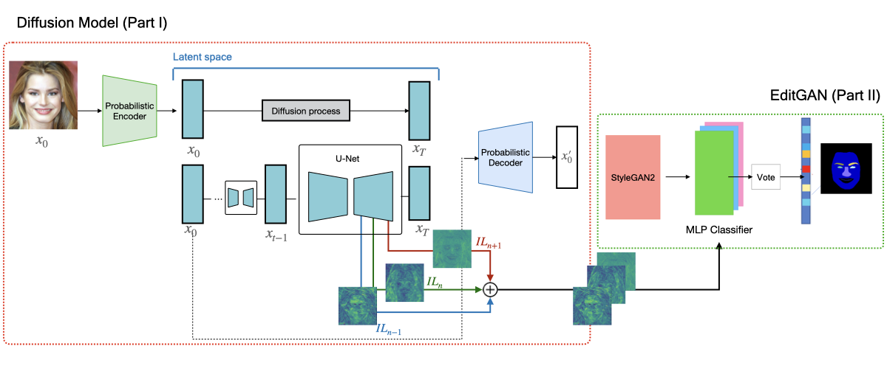
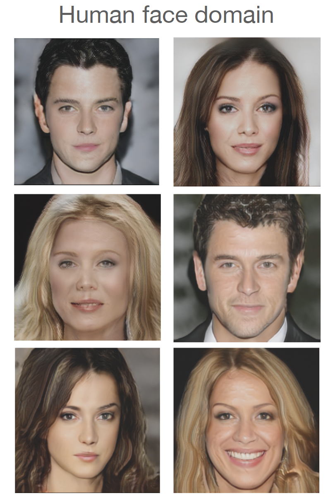
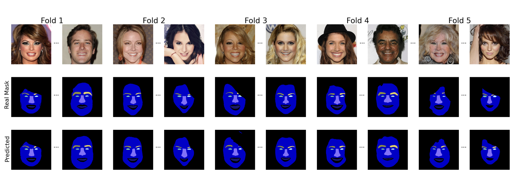

# maskGDM

This is the official code and data release for:

#### Semi-supervised semantic image segmentation by deep diffusion models and generative adversarial networks 


**International Journal of Neural System** **[paper]**

<p align="center">
   
</p>

## Requirements

- Python 3.10
- Pytorch 2.2.0.
- This code is tested with CUDA 12.3
- All results in our paper are based on Nvidia Tesla A100 GPUs. 

## Training 

To reproduce paper **Semi-supervised semantic image segmentation by deep diffusion models and generative adversarial networks**: 

```
cd maskgdm
```

1.1. Run **Step 1: Diffusion model training**.  
   1.2. Run **Step 1.2: Generate intermediate layers**

2. Run **Step 2: StyleGAN2 training**.
Then to train the styleGAN2 model for human face domain (for example) the output should achieve results like these:
<p align="center">
   
</p>

3. Run **Step 3: EditGAN interpreter training**.

#### 1.1 Diffusion model training
This step involves the training of the diffusion model and the extraction of the intermediate layers provided by the U-Net architecture. 

```
 python <path_scripts>/image_train.py --data_dir <path_images> --attention_resolutions 32,16,8 --image_size 256 --num_channels <num_channels> --num_head_channels <num_head_channels> --num_res_blocks <num_res_blocks> --learn_sigma <learn_sigma> --class_cond <class_cond> --diffusion_steps <diffusion_steps> --noise_schedule <noise_schedule> --use_kl <use_kl> --lr <lr> --batch_size <batch_size> --lr_anneal_steps <lr_anneal_steps> --microbatch -1 --use_fp16 <use_fp16> --dropout <dropout> --pretrained <pretrained>

```
<div align="left">

| **Hyper-parameter**  | **Value** |
|----------------------|:---------:|
| Attention resolution | 32, 16, 8 |
| Diffusion steps      | 1000      |
| Learn sigma          | True      |
| Noise scheduler      | Linear    |
| Nº Channels          | 256       |
| Nº Head channels     | 64        |
| Nº Res blocks        | 2         |
| Scale shift          | True      |

</div>

#### 1.2 Generating the intermediate layers
This step consist in the generation of the intermediate layers provided by the diffusion model previously trained.

```
 python <path_scripts>/image_sample.py --model_path <path_models>/model200000.pt --attention_resolutions <attention_resolutions> --class_cond <class_cond> --diffusion_steps <diffusion_steps> --image_size <image_size> --learn_sigma <learn_sigma> --noise_schedule <noise_schedule> --num_channels <num_channels> --num_head_channels <num_head_channels> --num_res_blocks <num_res_blocks> --use_fp16 <use_fp16> --batch_size <batch_size> --num_samples <num_samples> --timestep_respacing <timestep_respacing> --save_results <path_to_save_results> --intermediate_layers_saved <labels_intermediate_layers>
```

Note: In this case, the hiper-parameters will take the same values that the training diffusion model stage. Additionally, the argument **intermediate_layers_saved** is used to specify the intermediate layers which are necessary to extract.

#### 2. StyleGAN2 training
In this step we proceed to the train of the StyleGAN2.
```
python <path_scripts>/train_seg_gan.py --img_dataset <path_images> --seg_dataset <path_mask> --inception <path_inception>/model_inception.pkl --seg_name <seg_name> --checkpoint_dir <output_dir> --iter 100000 --batch 16 --seg_dim <seg_dim>
```

#### 3. EditGAN interpreter training
In this step we proceed to the train of the EditGAN. This stage consists of:
-  Train encoder
-  Train interpreter
-  Generate the results

Each of them take different json files as an input argument. All these input files are inside the folder *editGAN/scripts*

In the training interpreter 5-fold is established. Currently, this implementation produces one model classifier for each fold (*to be automated*)

<p align="center">
   
</p>


## 4. On-going
- Refactoring the code
- Automating steps
- Implementing code to measure the results

